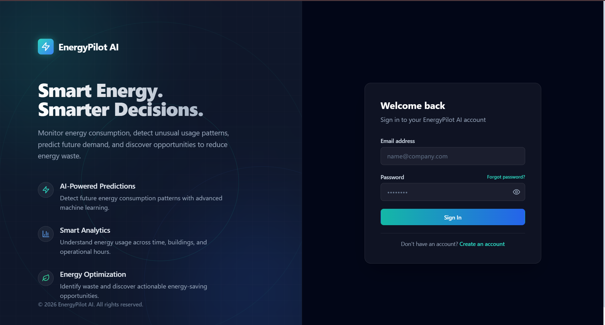
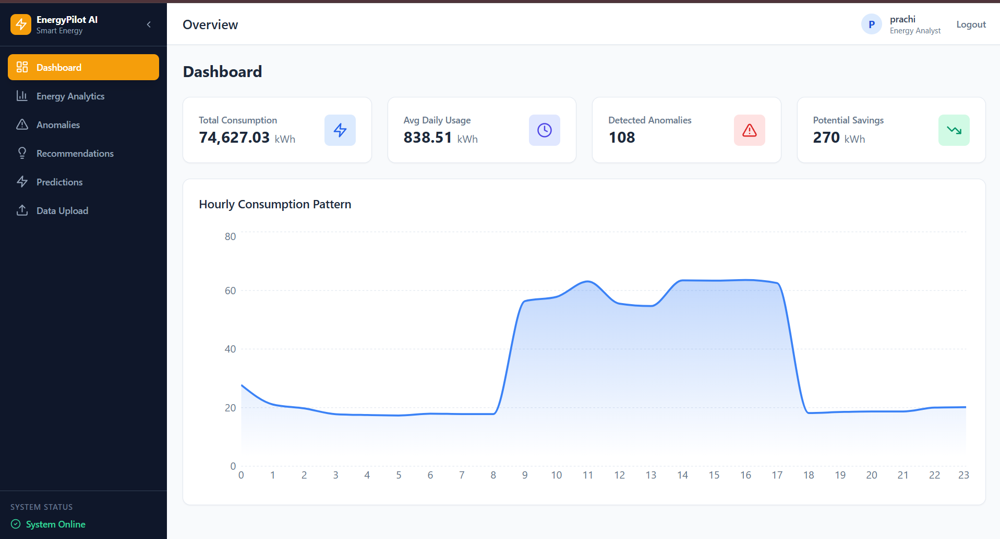
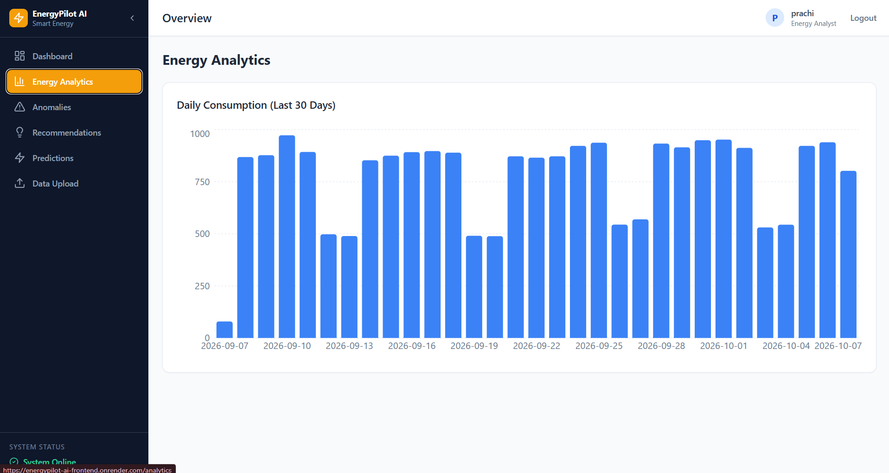
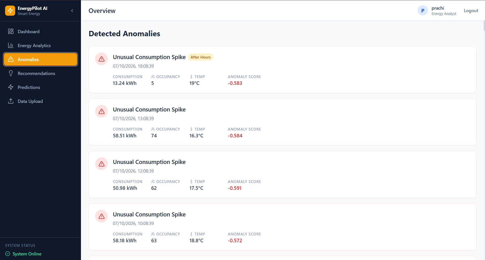
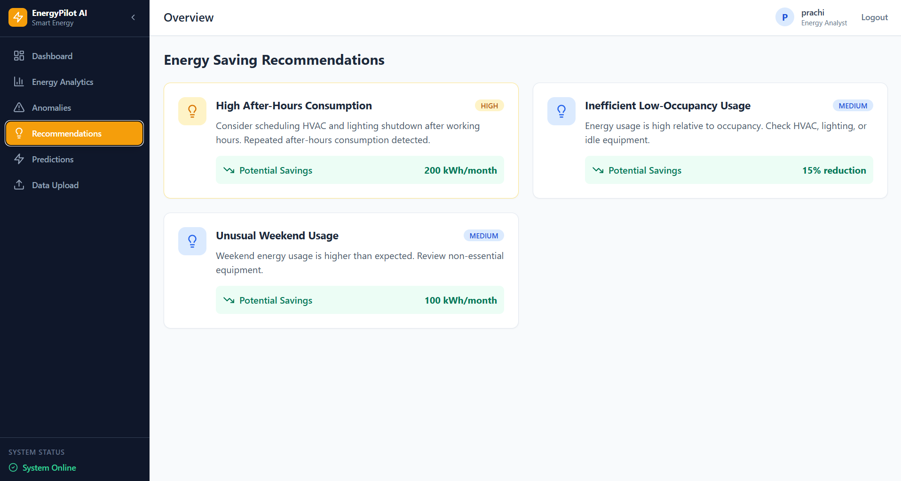
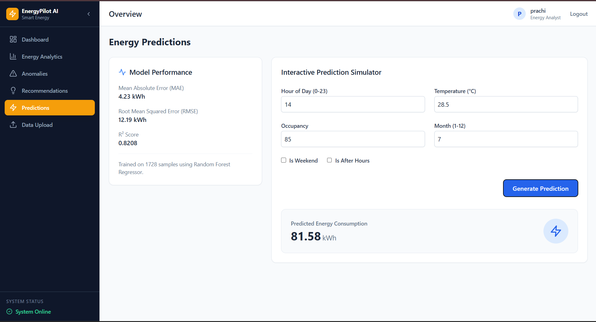
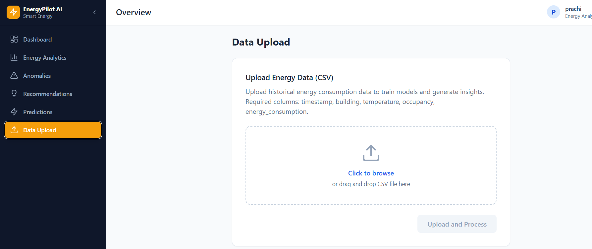

# ⚡ EnergyPilot AI

## AI-Powered Smart Energy Optimization Platform

React JavaScript Vite Tailwind CSS FastAPI Python PostgreSQL Scikit-learn Docker Render

EnergyPilot AI is a full-stack AI-powered energy intelligence platform that analyzes electricity consumption data, detects unusual usage patterns, predicts future energy consumption, and generates actionable recommendations to reduce energy waste.

Built with a React and Vite frontend and a Python FastAPI backend, the platform combines machine learning, data analytics, PostgreSQL, authentication, and interactive visualizations into a single energy monitoring and optimization system.

---

## 🚀 Live Demo

**Frontend:**  
https://energypilot-ai-frontend.onrender.com

**Backend:**  
https://energypilot-ai.onrender.com

**Backend Health:**  
https://energypilot-ai.onrender.com/api/health

---

## 📌 Overview

Energy consumption data contains valuable information about how buildings use electricity throughout the day. However, manually identifying inefficient usage, abnormal consumption patterns, and potential savings opportunities can be difficult.

EnergyPilot AI addresses this problem by bringing energy analytics, machine learning, anomaly detection, prediction, and recommendation capabilities into a single dashboard.

The platform helps answer questions such as:

- How much energy is being consumed?
- When does energy consumption increase?
- Which consumption patterns are unusual?
- Is energy being consumed during after-hours?
- Is energy being consumed during low-occupancy periods?
- What energy consumption can be expected under specific conditions?
- What actions could help reduce energy waste?

---

## ✨ Key Features

### 📊 Smart Energy Dashboard

Centralized dashboard providing:

- Total energy consumption
- Average daily energy usage
- Detected anomalies
- Potential energy savings
- Hourly consumption patterns
- System health status

### 📈 Energy Analytics

Interactive analytics for understanding historical energy usage through:

- Daily consumption trends
- Hourly consumption patterns
- Historical energy readings
- Consumption statistics
- Time-based analysis

### 🔍 AI Anomaly Detection

Uses **Isolation Forest** to identify unusual energy-consumption behavior.

The anomaly detection pipeline considers factors including:

- Energy consumption
- Temperature
- Occupancy
- Hour of day
- After-hours usage
- Weekend usage

Detected anomalies are presented through the dedicated Anomalies dashboard for investigation.

### 🔮 Energy Consumption Prediction

Uses a **Random Forest Regressor** to predict energy consumption based on:

- Hour
- Day of week
- Month
- Temperature
- Occupancy
- Weekend status
- After-hours status

Users can enter operating conditions and generate a custom energy-consumption prediction.

### 💡 Smart Recommendations

The recommendation engine converts energy usage patterns into actionable suggestions.

Examples include:

- Reducing high after-hours consumption
- Investigating unusual weekend usage
- Optimizing temperature settings
- Investigating unusual equipment behavior
- Improving occupancy-based energy management

### 📁 CSV Data Processing

Users can upload historical energy-consumption data directly through the application.

Required columns:

```text
timestamp
building
temperature
occupancy
energy_consumption
```

### 🔐 Authentication

The application includes user authentication using:

- User registration
- Secure password hashing
- JWT-based authentication
- Protected application routes
- Authenticated API requests

---

## 📸 Screenshots

All screenshots below are captured directly from the running EnergyPilot AI application.

### Login



### Dashboard



### Energy Analytics



### Anomalies



### Recommendations



### Predictions



### Data Upload



---

## 💻 Technology Stack

| Category | Technology | Purpose |
|---|---|---|
| Frontend | React | Component-based user interface |
| Language | JavaScript | Frontend application logic |
| Build Tool | Vite | Fast development and production bundling |
| Styling | Tailwind CSS | Responsive utility-first styling |
| Charts | Recharts | Interactive energy visualizations |
| Backend | FastAPI | Python REST API and backend services |
| Language | Python | Backend logic, data processing, and ML |
| Data Processing | Pandas | Energy dataset processing and analysis |
| Numerical Computing | NumPy | Numerical operations and feature processing |
| Machine Learning | Scikit-learn | Prediction and anomaly detection |
| Prediction Model | Random Forest Regressor | Energy consumption prediction |
| Anomaly Model | Isolation Forest | Unusual energy usage detection |
| Database | PostgreSQL | Persistent application and energy data storage |
| ORM | SQLAlchemy | Database models and persistence |
| Authentication | JWT | Secure API authentication |
| Password Security | bcrypt | Password hashing |
| API Communication | Axios | Frontend-to-backend communication |
| Containers | Docker | Application containerization |
| Orchestration | Docker Compose | Local multi-container development |
| Deployment | Render | Production hosting |

---

## 🏗️ Architecture

```text
                 Energy Consumption CSV
                         │
                         ▼
                  FastAPI Backend
                         │
              ┌──────────┼──────────┐
              │          │          │
              ▼          ▼          ▼
           Pandas     PostgreSQL   Authentication
              │
              ▼
       Feature Engineering
              │
        ┌─────┴─────┐
        │           │
        ▼           ▼
 Isolation Forest  Random Forest
   Anomaly           Energy
  Detection        Prediction
        │           │
        └─────┬─────┘
              │
              ▼
    Recommendation Engine
              │
              ▼
       FastAPI REST APIs
              │
              ▼
       React Dashboard
              │
       ┌──────┼────────┐
       ▼      ▼        ▼
   Analytics Anomalies Predictions
```

---

## 🔄 Application Workflow

```text
Energy CSV / User Input
          │
          ▼
     Data Upload
          │
          ▼
   FastAPI Data Layer
          │
          ▼
 Data Cleaning & Features
          │
    ┌─────┴─────┐
    ▼           ▼
Anomaly      Prediction
Detection      Model
    │           │
    └─────┬─────┘
          ▼
Recommendation Engine
          │
          ▼
       PostgreSQL
          │
          ▼
     React Dashboard
```

---

## 🤖 Machine Learning

### Anomaly Detection — Isolation Forest

EnergyPilot AI uses **Isolation Forest** to identify unusual energy-consumption observations.

The model evaluates multiple operational characteristics instead of relying only on raw energy consumption.

Features include:

- Energy consumption
- Temperature
- Occupancy
- Hour
- After-hours indicator
- Weekend indicator

The resulting anomaly scores are used to highlight potentially abnormal consumption behavior.

---

### Energy Prediction — Random Forest

The prediction system uses a **Random Forest Regressor** to estimate energy consumption based on operating conditions.

Input features include:

```text
hour
day_of_week
month
temperature
occupancy
is_weekend
is_after_hours
```

The prediction interface allows users to provide these conditions and request an estimated energy-consumption value through the backend API.

---

## 💡 Recommendation Engine

EnergyPilot AI includes a rule-based recommendation layer that translates detected consumption patterns into practical energy-saving suggestions.

The engine evaluates conditions such as:

- High after-hours energy usage
- High consumption with low occupancy
- Unusual weekend consumption
- Temperature-related inefficiencies
- Abnormal equipment-related usage patterns

This allows the application to move beyond analytics and provide **actionable recommendations**.

---

## 🔐 Authentication & Security

EnergyPilot AI implements JWT-based authentication for protected application functionality.

### Authentication Flow

```text
User
 │
 ▼
Register / Login
 │
 ▼
Password Verification
 │
 ▼
JWT Token
 │
 ▼
Authenticated API Requests
 │
 ▼
Protected Dashboard
```

Security measures include:

- Password hashing using bcrypt
- JWT-based authentication
- Protected frontend routes
- Authenticated API requests
- Environment-based configuration
- Sensitive credentials excluded from version control

**Security note:** Production secrets such as database credentials and JWT signing keys are stored as environment variables and should never be committed to the repository.

---

## 🗄️ Database

EnergyPilot AI uses **PostgreSQL** for persistent application data.

SQLAlchemy is used as the ORM layer between the FastAPI backend and PostgreSQL.

The database supports:

- User authentication data
- Energy consumption records
- Application data persistence
- Production data storage

The application also includes a database seeding mechanism that initializes the database using the provided energy-consumption dataset when required.

---

## 🔌 API

The FastAPI backend exposes REST endpoints for the application's main functionality.

### Health

```text
GET /api/health
```

### Dashboard

```text
GET /api/dashboard/summary
```

### Energy

```text
GET /api/energy
GET /api/energy/daily
GET /api/energy/hourly
POST /api/energy/upload
```

### Anomalies

```text
GET /api/anomalies
GET /api/anomalies/recent
GET /api/anomalies/summary
```

### Predictions

```text
GET /api/prediction
GET /api/prediction/next24hours
POST /api/prediction
```

### Recommendations

```text
GET /api/recommendations
```

### Authentication

```text
POST /api/auth/register
POST /api/auth/login
GET /api/auth/me
```

Interactive API documentation is available through FastAPI Swagger:

```text
https://energypilot-ai.onrender.com/docs
```

---

## 🐳 Docker

EnergyPilot AI includes Docker configuration for consistent local development and deployment.

The Docker Compose setup includes:

- PostgreSQL database
- FastAPI backend
- React frontend

To start the complete application locally:

```bash
docker compose up --build
```

The local services run on:

```text
Frontend: http://localhost:5174
Backend:  http://localhost:8001
Swagger:  http://localhost:8001/docs
PostgreSQL: localhost:5433
```

The backend connects to PostgreSQL through the Docker Compose service name rather than the host machine's localhost.

---

## ☁️ Production Deployment

EnergyPilot AI is deployed on **Render** using separate production services.

### Frontend

```text
React + Vite
        │
        ▼
Render Static Site
```

### Backend

```text
FastAPI
   │
   ▼
Docker Container
   │
   ▼
Render Web Service
```

### Database

```text
PostgreSQL
    │
    ▼
Render PostgreSQL
```

Production architecture:

```text
              Render
                 │
        ┌────────┴────────┐
        │                 │
        ▼                 ▼
 React Frontend      FastAPI Backend
                         │
                         ▼
                    PostgreSQL
```

The frontend communicates with the deployed FastAPI backend through the production API URL.

---

## 🧪 Testing

The backend includes automated API tests covering core application functionality.

Tests can be executed locally using:

```bash
docker compose exec backend pytest tests/test_api.py
```

The current test suite validates the application's core API behavior.

---

## 🛠️ Run Locally

### Prerequisites

- Git
- Python 3.10+
- Node.js 18+
- npm
- Docker and Docker Compose

### Option 1 — Docker Compose

Clone the repository:

```bash
git clone https://github.com/Prachi-Ukey/EnergyPilot-AI.git
```

Move into the project:

```bash
cd EnergyPilot-AI
```

Create your environment configuration using the provided template.

Start the application:

```bash
docker compose up --build
```

Open:

```text
Frontend:
http://localhost:5174

Backend:
http://localhost:8001

Swagger:
http://localhost:8001/docs
```

### Option 2 — Run Backend and Frontend Separately

Backend:

```bash
cd backend

python -m venv venv
```

Windows PowerShell:

```powershell
.\venv\Scripts\Activate.ps1
```

Install dependencies:

```bash
pip install -r requirements.txt
```

Start FastAPI:

```bash
uvicorn app.main:app --reload --port 8001
```

Frontend:

```bash
cd frontend
npm install
npm run dev
```

---

## 📂 Project Structure

```text
EnergyPilot-AI/
│
├── backend/
│   ├── app/
│   │   ├── database/
│   │   │   ├── connection.py
│   │   │   └── models.py
│   │   │
│   │   ├── ml/
│   │   │   ├── anomaly_detection.py
│   │   │   └── prediction.py
│   │   │
│   │   ├── routes/
│   │   │   ├── anomalies.py
│   │   │   ├── auth.py
│   │   │   ├── dashboard.py
│   │   │   ├── energy.py
│   │   │   ├── prediction.py
│   │   │   └── recommendations.py
│   │   │
│   │   ├── services/
│   │   │   ├── data_service.py
│   │   │   ├── recommendation_service.py
│   │   │   └── seed_service.py
│   │   │
│   │   ├── auth.py
│   │   ├── config.py
│   │   └── main.py
│   │
│   ├── tests/
│   │   └── test_api.py
│   │
│   ├── data/
│   │   └── energy_consumption.csv
│   │
│   ├── Dockerfile
│   └── requirements.txt
│
├── data/
│   └── energy_consumption.csv
│
├── frontend/
│   ├── src/
│   │   ├── components/
│   │   │   ├── AuthLayout.jsx
│   │   │   ├── Sidebar.jsx
│   │   │   └── TopBar.jsx
│   │   │
│   │   ├── context/
│   │   │   └── AuthContext.jsx
│   │   │
│   │   ├── pages/
│   │   │   ├── AnomaliesPage.jsx
│   │   │   ├── Dashboard.jsx
│   │   │   ├── DataUploadPage.jsx
│   │   │   ├── EnergyAnalytics.jsx
│   │   │   ├── Login.jsx
│   │   │   ├── PredictionsPage.jsx
│   │   │   ├── RecommendationsPage.jsx
│   │   │   └── Register.jsx
│   │   │
│   │   ├── services/
│   │   │   └── api.js
│   │   │
│   │   ├── App.jsx
│   │   ├── index.css
│   │   └── main.jsx
│   │
│   ├── Dockerfile
│   ├── package.json
│   └── vite.config.js
│
├── screenshots/
│   ├── analytics.png
│   ├── anomalies.png
│   ├── dashboard.png
│   ├── data-upload.png
│   ├── login.png
│   ├── predictions.png
│   └── recommendations.png
│
├── docker/
├── .env.example
├── .gitignore
├── docker-compose.yml
├── generate_data.py
└── README.md
```

---

## 📊 Sample Dataset

The project includes a sample energy-consumption dataset for development and demonstration.

The dataset contains information such as:

- Timestamp
- Building
- Temperature
- Occupancy
- Energy consumption

The application processes this data through the FastAPI backend before storing and analyzing it.

---

## 🔭 Future Improvements

Planned enhancements for EnergyPilot AI include:

- Advanced time-series forecasting using LSTM or Transformer-based models
- Building-level energy benchmarking
- Real-time IoT smart-meter integration
- Carbon-emission estimation
- Automated energy-saving alerts
- Energy-cost prediction
- More advanced anomaly explanations
- Personalized optimization recommendations
- Historical prediction accuracy tracking
- Role-based access control for energy managers and administrators
- Cloud-based scheduled model retraining
- Advanced energy consumption visualizations

---

## 💼 Portfolio Summary

EnergyPilot AI is a full-stack AI-powered smart energy optimization platform that combines energy analytics, anomaly detection, consumption prediction, and actionable recommendations in a single application.

The system uses React and Vite for the frontend, FastAPI and Python for the backend, PostgreSQL for persistent storage, Scikit-learn for machine learning, and Docker for containerization. JWT authentication protects application access, while the platform is deployed in production using Render.

The project demonstrates practical experience across **full-stack development, REST APIs, machine learning, data processing, authentication, databases, Docker, and cloud deployment**.

---

## 👩‍💻 Author

**Prachi Ukey**

GitHub:  
https://github.com/Prachi-Ukey

---
